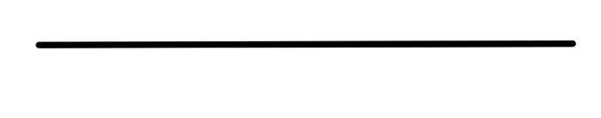
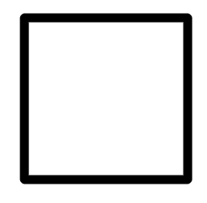

## Table of Contents

| Chapter Title        |
|:--------------------:|
| Introduction         |
| What Do I Need?      |
| Drawing Basic Shapes |
| Drawings A Face      |
| Credits              |

## Introduction

I have always enjoyed art, but whenever I have drawn something, especially characters, I never liked them and that really put me off. But then I started watching tutorials and process videos on YouTube from people such as Brad Colbow, Saultoons, Rakurri and David Revoy, all of whom inspired me to improve my drawing and helped with the videos they produce. This book compiles all that I have learnt from them and from what I have taught myself.

## What Do I Need?

Well, you don't need that much, to start out in traditional art (on paper), you simply need a pencil and a bit of paper. If you want to do digital art, you don't nesisarily need a fancy drawing tablet (but you can get one if you want), you can use just your mouse, there will be a whole section on digital art so don't worry.

## Drawing Basic Shapes

### Drawing A Line

So now you've got a pencil and a bit of paper. Draw a line on the paper. Done? Now you're drawing. Drawing is basically just drawing lines with different angles, directions, thicknesses and opacity.

### Drawing A Box

Now you've drawn a line, draw 4 straight lines each one connecting to 1 other line at a 90 degree angle. You have now drawn a square.

 

## Drawing A Face

## Credits
David Revoy - https://davidrevoy.com

Saultoons - 

Brad Colbow - 

Rakurri - https://linktr.ee/Rakurri
